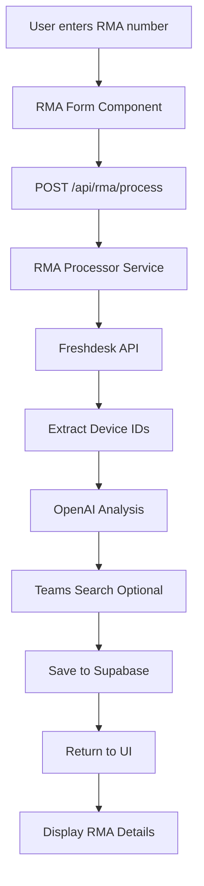
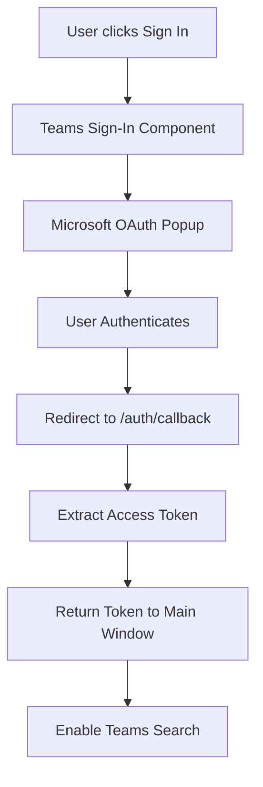

# RMA Management System - Project Overview

## 🎯 Purpose

The RMA Management System is a Next.js application designed to streamline the Return Merchandise Authorization (RMA) process by:
- Fetching ticket information from Freshdesk
- Analyzing return reasons using OpenAI
- Searching Microsoft Teams for device-related conversations
- Storing and displaying processed RMA data

## 🏗️ Architecture

### Technology Stack
- **Frontend**: Next.js 14 (App Router), React, TypeScript, Tailwind CSS
- **Backend**: Next.js API Routes
- **Database**: Supabase (PostgreSQL)
- **External Services**: Freshdesk API, OpenAI API, Microsoft Graph API
- **Authentication**: Microsoft Authentication Library (MSAL) for Teams integration

### Project Structure

```
freshdesk_rma_checker/
├── app/                      # Next.js App Router
│   ├── api/                  # API Routes
│   │   ├── rma/             
│   │   │   ├── process/     # POST: Process new RMA, GET: List RMAs
│   │   │   └── [rmaNumber]/ # GET: Fetch specific RMA, DELETE: Remove RMA
│   │   └── teams/
│   │       └── search/      # POST: Search Teams messages
│   ├── auth/
│   │   └── callback/        # OAuth callback for Teams authentication
│   ├── page.tsx             # Main dashboard page
│   ├── layout.tsx           # Root layout
│   └── globals.css          # Global styles
│
├── components/              # React Components
│   ├── rma-form.tsx        # Form for entering RMA numbers
│   ├── rma-ticket-display.tsx # Display processed RMA details
│   ├── teams-signin-safe.tsx  # Teams authentication component
│   └── ui/                 # Reusable UI components
│       ├── badge.tsx
│       ├── button.tsx
│       ├── card.tsx
│       └── input.tsx
│
├── lib/                    # Core Business Logic
│   ├── interfaces/         # TypeScript interfaces
│   │   └── index.ts       # Service contracts and data models
│   ├── services/          # Service implementations
│   │   ├── logger.service.ts    # Centralized logging
│   │   └── supabase.service.ts  # Database service
│   ├── config.ts          # Application configuration
│   ├── database.types.ts  # Supabase database types
│   ├── errors.ts          # Error handling utilities
│   ├── freshdesk.ts       # Freshdesk API integration
│   ├── openai.ts          # OpenAI API integration
│   ├── rma-processor.ts   # Main RMA processing logic
│   ├── schemas.ts         # Zod validation schemas
│   ├── supabase.ts        # Supabase client initialization
│   ├── teams.ts           # Microsoft Teams integration
│   ├── types.ts           # TypeScript type definitions
│   └── utils.ts           # Utility functions
│
├── Configuration Files
│   ├── .env.local         # Environment variables (not in git)
│   ├── next.config.js     # Next.js configuration
│   ├── tailwind.config.js # Tailwind CSS configuration
│   ├── tsconfig.json      # TypeScript configuration
│   ├── postcss.config.js  # PostCSS configuration
│   └── package.json       # Dependencies and scripts
```

## 🔄 Data Flow

### 1. RMA Processing Flow


### 2. Teams Authentication Flow


## 📊 Database Schema

### `rma_tickets` Table
```sql
CREATE TABLE rma_tickets (
  id SERIAL PRIMARY KEY,
  rma_number TEXT UNIQUE NOT NULL,
  date TIMESTAMP,
  vids_associated TEXT[],
  customer_information TEXT,
  primary_reason TEXT,
  specific_issue TEXT,
  customer_impact TEXT,
  additional_notes TEXT,
  status TEXT,
  teams_search_results JSONB,
  teams_summary TEXT,
  processing_status TEXT DEFAULT 'completed',
  created_at TIMESTAMP WITH TIME ZONE DEFAULT NOW(),
  updated_at TIMESTAMP WITH TIME ZONE DEFAULT NOW()
);
```

## 🔧 Key Services

### RMAProcessor
- **Purpose**: Orchestrates the entire RMA processing workflow
- **Responsibilities**:
  - Fetches ticket data from Freshdesk
  - Extracts device IDs from ticket content
  - Sends ticket for AI analysis
  - Optionally searches Teams for device mentions
  - Saves processed data to Supabase

### FreshdeskService
- **Purpose**: Interfaces with Freshdesk API
- **Key Methods**:
  - `getTicket()`: Fetches ticket details by ID
  - `extractDeviceIds()`: Extracts 10-character device IDs (especially those starting with "5A")
  - `buildTicketText()`: Formats ticket data for AI analysis
  - `mapStatusCode()`: Maps numeric status codes to readable labels

### OpenAIService
- **Purpose**: Analyzes tickets using GPT-4o-mini
- **Returns**: Structured analysis including:
  - Primary reason for return
  - Specific issue details
  - Customer impact
  - Additional notes

### TeamsService
- **Purpose**: Searches Microsoft Teams for device-related conversations
- **Features**:
  - Searches personal and group chats
  - Searches team channels
  - Filters by date range (last 6 months)
  - Returns relevant message context

## 🔐 Authentication & Security

### Environment Variables
```env
# Supabase
NEXT_PUBLIC_SUPABASE_URL=your_supabase_url
NEXT_PUBLIC_SUPABASE_ANON_KEY=your_anon_key
SUPABASE_SERVICE_ROLE_KEY=your_service_key

# Freshdesk
FRESHDESK_SUBDOMAIN=your_subdomain
FRESHDESK_API_KEY=your_api_key

# OpenAI
OPENAI_API_KEY=your_openai_key

# Microsoft Teams
NEXT_PUBLIC_MICROSOFT_CLIENT_ID=your_client_id
NEXT_PUBLIC_MICROSOFT_TENANT_ID=your_tenant_id
MICROSOFT_CLIENT_SECRET=your_client_secret

# Optional Configuration
VIDS_FIELD_KEY=cf_vids_associated
OPENAI_MODEL=gpt-4o-mini
```

### Security Features
- API routes use Zod for input validation
- Centralized error handling prevents information leakage
- Teams authentication uses OAuth 2.0 implicit flow
- Service role keys are server-side only
- Comprehensive logging for debugging (console-based)

## 🚀 Running the Application

### Development
```bash
# Install dependencies
npm install

# Run development server
npm run dev

# Application available at http://localhost:3000
```

### Production Build
```bash
# Build for production
npm run build

# Start production server
npm start
```

## 🧪 Key Features

### 1. RMA Processing
- Automatic ticket fetching from Freshdesk
- Intelligent device ID extraction (regex patterns for various formats)
- AI-powered return reason analysis
- Batch processing prevention (checks for existing tickets)

### 2. Teams Integration
- User-based authentication (delegated permissions)
- Searches for 10-character device IDs starting with "5A"
- Returns message context and author information
- Handles enterprise restrictions gracefully

### 3. User Interface
- Real-time processing status updates
- Clean, modern UI with Tailwind CSS
- Responsive design
- Error state handling
- Loading states and animations

## 📈 Best Practices Implemented

### Code Organization
- Separation of concerns (services, components, utilities)
- Dependency injection through interfaces
- Centralized configuration management
- Consistent error handling patterns

### TypeScript
- Strict type checking enabled
- Interfaces for all service contracts
- Zod schemas for runtime validation
- Type-safe database queries

### Performance
- Efficient data fetching strategies
- Proper error boundaries
- Optimized re-renders
- Background processing for long operations

### Maintainability
- Comprehensive logging
- Clear error messages
- Modular architecture
- Well-documented code structure

## 🔍 Troubleshooting

### Common Issues
1. **"0 chats found" in Teams search**
   - Enterprise may restrict chat enumeration
   - Ensure user has granted Chat.ReadWrite.All permission
   - Check if signed in with correct Microsoft account

2. **Freshdesk 404 errors**
   - Verify RMA number exists in Freshdesk
   - Check FRESHDESK_SUBDOMAIN configuration
   - Ensure API key has proper permissions

3. **OpenAI quota exceeded**
   - Check OpenAI account credits
   - System continues without AI analysis on failure

4. **Database connection issues**
   - Verify Supabase URL and keys
   - Check if table exists with correct schema
   - Ensure service role key has proper permissions

## 🎯 Future Enhancements

Potential areas for improvement:
- Add unit and integration tests
- Implement caching for frequently accessed data
- Add export functionality for processed RMAs
- Enhance Teams search with more granular filters
- Add webhook support for real-time Freshdesk updates
- Implement user authentication and multi-tenancy
- Add advanced analytics and reporting features
